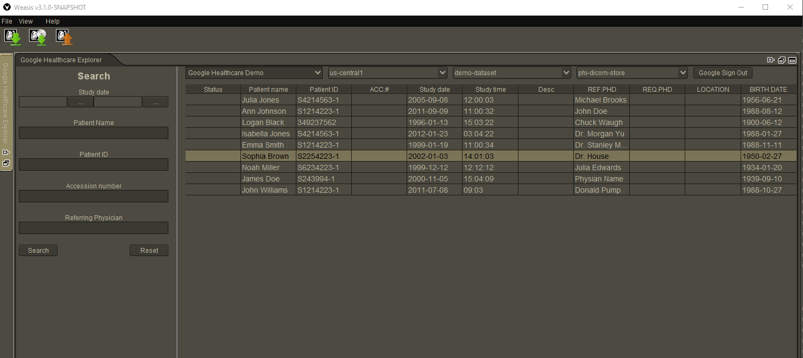

### About Weasis Google DICOM Plugin
Plugin enables Weasis Viewer users access to [Google Cloud Healthcare API](https://cloud.google.com/healthcare) DICOM data.  
It utilizes [DICOMweb REST API](https://cloud.google.com/healthcare/docs/how-tos/dicomweb) to interact with Google Cloud services.  
#### Features
* Login using your Google account
* Interactive exploration of Google Healthcare API Dicom stores
* Download and display all kinds of DICOM data
* Advanced study search capabilities  



#### Setting up access to Google Healthcare data:
* open [Google Cloud Console](https://console.cloud.google.com/apis/credentials) 
* create new OAuth Client ID (Application Type: Other). 
* Download **_client_secrets.json_** 
* Refer to [access-control](https://cloud.google.com/healthcare/docs/concepts/access-control) section of
Cloud Healthcare API Documentation for additional information.

#### How to build and run Weasis
Weasis requires JDK8.  
Detailed build instruction can be found at
[building Weasis](https://nroduit.github.io/en/getting-started/building-weasis/) 

* Clone this repository and execute following script:
```bash
cd Weasis

## Checkout branch
git checkout google_dicom_explorer 

## build all Weasis modules
mvn clean install

## build Weasis distributions
cd weasis-distributions
mvn clean package -Dportable=true

## unzip portable Weasis
cd target/portable-dist
unzip weasis-portable.zip
```
* Copy **_client_secrets.json_** file to target/portable-dist folder (next to viewer-win32.exe and viewer-linux.sh)
* Run Weasis Viewer executable
* Switch to **_Google Dicom Explorer_** tab and login using your Google Account
* Explore your DICOM data
